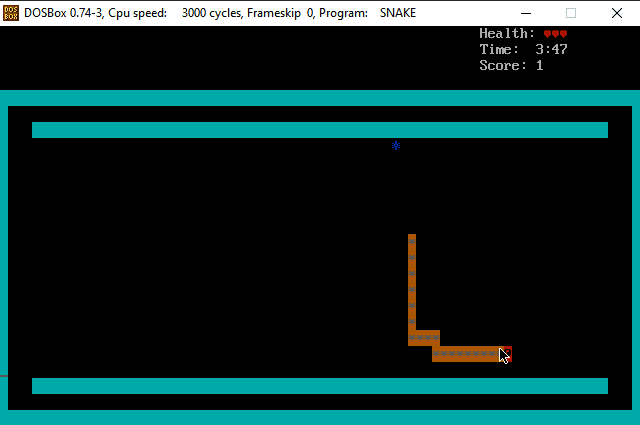

[![MIT License][license-shield]][license-url]

<!-- PROJECT LOGO -->
<br />
<p align="center">
  <a href="https://github.com/github_username/repo_name">
    
  </a>

  <h3 align="center">Snake Game</h3>

  <p align="center">
  Implementation of the classic Snake Game in the 8086 Assembly
</p>


<!-- TABLE OF CONTENTS -->
<details open="open">
  <summary><h2 style="display: inline-block">Table of Contents</h2></summary>
  <ol>
    <li>
      <a href="#about-the-project">About The Project</a>
      <ul>
        <li><a href="#built-with">Built With</a></li>
      </ul>
    </li>
    <li>
      <a href="#getting-started">Getting Started</a>
      <ul>
        <li><a href="#prerequisites">Prerequisites</a></li>
        <li><a href="#installation">Installation</a></li>
      </ul>
    </li>
    <li><a href="#usage">Usage</a></li>
    <ul>
        <li><a href="#how-to-run">How to Run</a></li>
        <li><a href="#output-images">Output Images</a></li>
      </ul>
    <li><a href="#license">License</a></li>
  </ol>
</details>

<!-- ABOUT THE PROJECT -->
## About The Project

This is an implementation of the classic Snake Game in the 8086 Assembly. This game includes, a menu, poison fruits, normal fruits, health counter, speed increment, time limit etc.


### Built With

* [8086 Assembly](https://en.wikipedia.org/wiki/X86_assembly_language)


<!-- GETTING STARTED -->
## Getting Started

To get a local copy up and running follow these simple steps.

### Prerequisites

* [DosBox](https://www.dosbox.com/download.php?main=1)

### Installation

1. Download this project and move to C:\ (C root directory)
2. After installation of DOSBOX, go to the installation directory and run **_DOSBox 0.74 Options.bat_**.
3. At the end of the file add these two lines and save:
   ```sh
   mount c: c:\NAME_OF_DOWNLOADED_FOLDER 
   c:
   ```

<!-- USAGE EXAMPLES -->
## Usage

### How to Run
1. Now run DOSBOX, and enter the following command:
   ```sh
   nasm Snake.asm -o Snake.com
   ```
   
   ***OR***
   
2. Run DOSBOX, and simply enter:
   ```sh
   Snake.com
   ```

### Output Images
  
  
  
  
<!-- LICENSE -->
## License

Distributed under the MIT License. See `LICENSE` for more information.


<!-- MARKDOWN LINKS & IMAGES -->
<!-- https://www.markdownguide.org/basic-syntax/#reference-style-links -->
[license-shield]: https://img.shields.io/github/license/saeenyoda/Inverted_Indexing?label=license&style=for-the-badge
[license-url]: https://github.com/saeenyoda/Inverted_Indexing/blob/master/LICENSE
